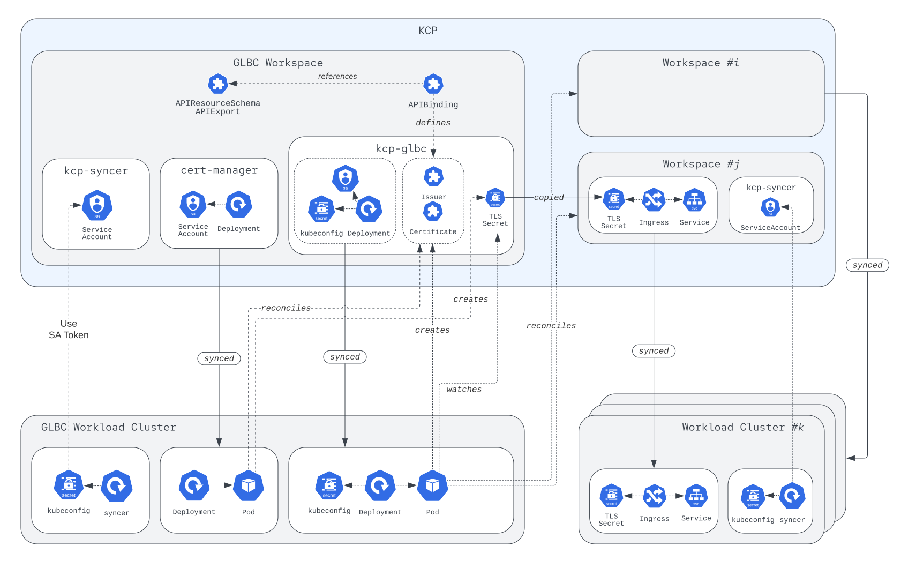

# GLBC Deployment via KCP

Authors: @astefanutti

Epic: https://github.com/Kuadrant/kcp-glbc/issues/94

Date: 2022-05-10

## Goal

The goal of this proposal is to research deploying the GLBC, including all its components and dependencies via KCP.

## Rationale

Currently, the GLBC is deployed in a Kubernetes cluster, referred as the GLBC _control_ cluster, outside the KCP control plane.
The GLBC dependencies, such as [cert-manager](https://cert-manager.io), and eventually [external-dns](https://github.com/kubernetes-sigs/external-dns), are deployed alongside the GLBC in that _control_ cluster.

These components coordinate via a shared state, that's persisted in the _control_ cluster data plane.

The following benefits are envisioned:
* Leverage the data durability guarantees, provided by hosted KCP environments;
* Compute commoditization, and workload movement.

## Proposal

### Architecture

It is proposed to deploy the GLBC and its dependencies in a dedicated KCP workspace, and rely on the [transparent deployment feature][1] that KCP provides, so that GLBC controllers are synced and running in workload clusters, while transparently operating on the data plane that resides in KCP.

This is illustrated in the following diagram:



This entails:
* The KCP syncer is deployed in the GLBC workload cluster with the default set of synced resources, i.e., `deployments.apps`, `secrets`, `configmaps`, `serviceaccounts`;
* The _cert-manager_ deployment is tailored to run the minimal set of required controllers (using the `--controllers=issuers,certificaterequests-issuer-acme,certificaterequests-issuer-ca,certificates-readiness` option), synced into the workload cluster, and operates on the GLBC workspace, thanks to the transparent deployment feature;
* The required _cert-manager_ APIs may be deployed using KCP API management APIs (`APIResourceSchema`, `APIExport`), so that it'll be possible to leverage any _cert-manager_ service, that may eventually already be hosted in some KCP environments, as covered by the KCP [API bindings demo](https://github.com/kcp-dev/kcp/blob/main/contrib/demo/prototype3-script/script-apibindings.sh).
However, _cert-manager_ standard CRDs can equally be used at the beginning;
* The _kcp-glbc_ controller is synced into the workload cluster, and operates on the "internal" data plane in the GLBC workspace, thanks to the transparent deployment feature;
* The _kcp-glbc_ controller is configured with a kubeconfig that contains the client configuration for the "external" data plane;

[1]: https://github.com/kcp-dev/kcp/issues/280

### Actions

* _cert-manager_ typically relies on [webhooks](https://cert-manager.io/docs/concepts/webhook/), which are not currently covered by the transparent deployment feature.
This is tracked by https://github.com/kcp-dev/kcp/issues/333, in the meantime the proposal is to strip the webhooks from the _cert-manager_ configuration;
* The _kcp-glbc_ kubeconfig file that configures the client used to connect to the "external" data plane, has to be generated manually, and either target a single or all workspaces.
This should ideally be transparent, and targeting a view of the workspaces that have the GLBC API bound only (note this point is general, and not strictly related to this proposal);
* Some fixes may have to follow-up for the transparent deployment feature: this is tracked by https://github.com/kcp-dev/kcp/issues/280; 
* This proposal should ultimately be extended to reason about how sharding impacts the proposed deployment model.

### Script

```shell
# Create the GLBC workspace
$ kubectl kcp workspace create kcp-glbc --enter
# Setup the workload cluster
$ kubectl create ns kcp-syncer
$ kubectl kcp workload sync glbc-workload-cluster --kcp-namespace kcp-syncer --syncer-image ghcr.io/kcp-dev/kcp/syncer:v0.4.0-alpha.0 | KUBECONFIG=tmp/kcp-cluster-glbc-control.kubeconfig kubectl apply -f -
# TODO: deploy tailored cert-manager and required APIs
# Create the GLBC deployment
$ kubectl create ns kcp-glbc
$ kustomize build config/deploy/local | k apply -f -
# Export the GLBC APIs
$ kubectl -n kcp-glbc apply -f utils/kcp-contrib/apiresourceschema.yam
$ kubectl -n kcp-glbc apply -f utils/kcp-contrib/apiexport.yaml

# Create the user workspace
$ kubectl kcp workspace ..
$ kubectl kcp workspace create demo --enter
# Setup the workload cluster
$ kubectl create ns kcp-syncer
$ kubectl kcp workload sync kcp-cluster-1 --kcp-namespace kcp-syncer --syncer-image ghcr.io/kcp-dev/kcp/syncer:v0.4.0-alpha.0 --resources services,ingresses.networking.k8s.io | KUBECONFIG=../kcp-glbc/tmp/kcp-cluster-1.kubeconfig k apply -f -
# Import the GLBC APIs
$ kubectl apply -f utils/kcp-contrib/apibinding.yaml
# Deploy the sample application
$ kubectl apply -f samples/echo-service/echo.yaml
```
