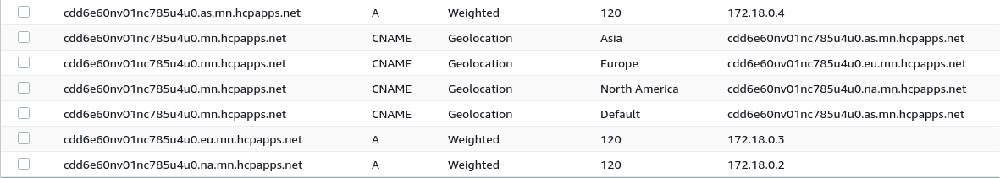

# Geo Aware DNS

Authors: Michael Nairn @mikenairn

Epic: https://github.com/kcp-dev/kcp-glbc/issues/414

Date: 20th Oct 2022

## Job Stories

- As the owner of a globally distributed hybrid cloud application, I want the DNS for my application to be geo aware so that users are sent to the closest available location in order to serve their requests

## Goals

- Ensure users of a deployed application are routed to the closest geographical deployment of it. 

## Non Goals

- 

## Current Approach

GLBC currently creates A records with a weighted routing policy and does not take geographic location into consideration.

## Proposed Solution

### DNS Records

Update the DNSRecords that we create for traffic resources (ingresses/routes) to include both CNAME records using a [GeoLocation](https://docs.aws.amazon.com/Route53/latest/DeveloperGuide/routing-policy-geo.html) routing policy and A records using a [Weighted](https://docs.aws.amazon.com/Route53/latest/DeveloperGuide/routing-policy-weighted.html) routing policy.

A CNAME record will be created for each continent that a traffic resource has a workload deployed to. 
The name of these records will be the glbc host name e.g. xyz.dev.hcpapps.net, the Geo Location will be set to a [continent code](https://docs.aws.amazon.com/Route53/latest/DeveloperGuide/resource-record-sets-values-geo.html) e.g. NA (North America), and will have a single value pointing to a host (see A Records) dedicated to that location i.e (xyz.na.dev.hcpapps.net)

A CNAME record will be created to act as the default for continents that do not have an explicit Geo Location CNAME created for them.
The name of these records will be the glbc host name e.g. xyz.dev.hcpapps.net, the Geo Location will be set to '*' (Default) , and will have a single value pointing to a host (see A Records) of an existing continent i.e (xyz.na.dev.hcpapps.net)

An A record will be created for each IP address available in a given location.
The name of these records will the glbc host name with a continent specific code inserted e.g. xyz.**na**.dev.hcpapps.net, the weight will be a value set based on the number of clusters/IPs in that continent e.g. 120, and will have a single value of the IP address. 

Example set of Route53 records covering 3 continents(Asia, Europe and North America):



### DNSRecord reconciliation updates

The DNSRecord reconciliation will be updated to include the creation of CNAME type records and add support for specifying geo location porvider specific properties.

Example CNAME with aws geo policy property:
```yaml
- dnsName: xyz.dev.hcpapps.net
      recordTTL: 60
      recordType: CNAME
      setIdentifier: NA
      providerSpecific:
        - name: "aws/geolocation-continent-code"
          value: "NA"
      labels:
        id: NA
      targets:
        - xyz.na.dev.hcpapps.net
```

### Traffic resource (Ingress/Route) reconciliation updates

The reconciliation of traffic resources will updated to group clusters and IP addresses by continent.
A GeoIP lookup service will be used to discover the geographic location of each IP, and it's continent, in order to group appropriately.
A DNSRecord, as described above, will be created for each traffic resource, containing CNAMES for each available continent, and A records for each available IP address within each continent.  
The weight for A records will be calculated based on the number of IP addresses available in each continent.

### GEO Lookup

An interface for GeoIP lookup will be added to GLBC allowing different services/mechanisms for GEO IP lookup to be utilised as required.
Example:
```go
dns.Geos(traffic)[]Geo,error
```

A `Geo` object would contain relevant geographical information for each IP Address, the most important to us being the continent code.
Example:
```go
type Geo struct {
	Continent     string  `json:"continent"`
	ContinentCode string  `json:"continent_code"`
	Country       string  `json:"country"`
	CountryCode   string  `json:"country_code"`
	Region        string  `json:"region"`
	RegionCode    string  `json:"region_code"`
	City          string  `json:"city"`
	Latitude      float64 `json:"latitude"`
	Longitude     float64 `json:"longitude"`
}
```

#### GEO IP Lookup External service

Initially we will integrate against an external geoip lookup service.
A number of options exist for geo ip lookup, and further investigation might be required to find the most suitable.
Some options are:

* https://ipwhois.io (Used in POC)
* https://ipstack.com

#### GEO API

A mechanism by which a compute admin can specify geo location information for sync targets will be created.
This would take precedence over any other geo ip lookup regrding that sync targets IPs.
The details of this will take further investigation and will likely rely on not yet existing KCP features.

## Testing

The e2e tests should be updated to take into account the change in DNSRecord endpoints expected. We should also expand the tests where possible to include sync targets in different geographic locations (can be mocked).

## Checklist

- [ ] An epic has been created and linked to
- [ ] Reviewers have been added. It is important that the right reviewers are selected.
